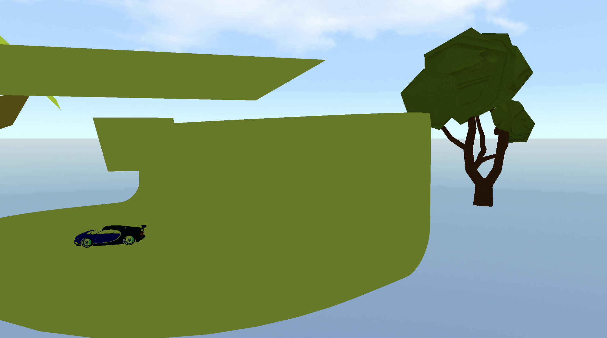

<p align="center"><h1 align="center">scop</h1></p>
<p align="center">
    C++とOpenGLで実装されたシンプルな3Dモデルビューア
</p>
<p align-="center">
    <a href="./LICENSE">
    
</a>

</p>




<br>

## Contents

- [Overview](#overview)
- [Features](#features)
- [Getting Started](#getting-started)
  - [Prerequisites](#prerequisites)
  - [Installation](#installation)
  - [Usage](#usage)
- [License](#license)

---

## Overview

`scop` は、C++11とOpenGLで実装された3Dモデルビューア。
`scop.conf`という設定ファイルに基づいて、複数の`.obj`モデルの描画、テクスチャやトランスフォーム（位置、回転、スケール）の適用、スカイボックスの表示を行う。

---

## Features
- **.objファイル描画**: `tinyobjloader`を利用して`.obj`フォーマットの3Dモデルを読み込み、描画
- **テクスチャマッピング**: モデルにテクスチャ画像を適用
- **スカイボックス**: キューブマップを使用してシーンの背景（空など）を描画
- **外部ファイルによる動的設定**: `scop.conf`ファイルで、描画するオブジェクト、テクスチャ、位置、回転、スケールを自由に設定可能
- **複数オブジェクト対応**: シーン内に複数のオブジェクトを異なる設定で配置可能
- **カメラ操作**: キーボード入力によるカメラの移動、回転、FOV（視野角）の変更
- **クロスプラットフォーム**: macOSとLinuxの両方でビルド・実行可能

---
## Getting Started

### Prerequisites
- **C++ Compiler** (`C++11` standard)
- **GNU make** (`3.81` or later)
- **OpenGL Libraries**: `GLFW` and `GLEW`

**macOS (Homebrew)**
```sh
❯ brew install glfw glew
```

**Linux (Debian/Ubuntu)**
```sh
❯ sudo apt update
❯ sudo apt install libglfw3-dev libglew-dev
```

### Installation

```sh
❯ git clone https://github.com/icchon/scop
❯ cd scop
❯ make
```

### Usage
アプリケーションの起動。
引数として設定ファイルを渡す必要がある。
```sh
❯ ./scop [path/to/your.conf]
```
**Example:**
```sh
❯ ./scop scop.conf
```
設定ファイル(`scop.conf`)では、ウィンドウサイズ、カメラ速度、シェーダーパス、スカイボックスのパス、および描画したい各オブジェクトのモデルパス、テクスチャパス、位置、回転、スケールを定義する。

---

## License
This project is licensed under the MIT License - see the [LICENSE](./LICENSE) file for details.

© 2026 scop contributers